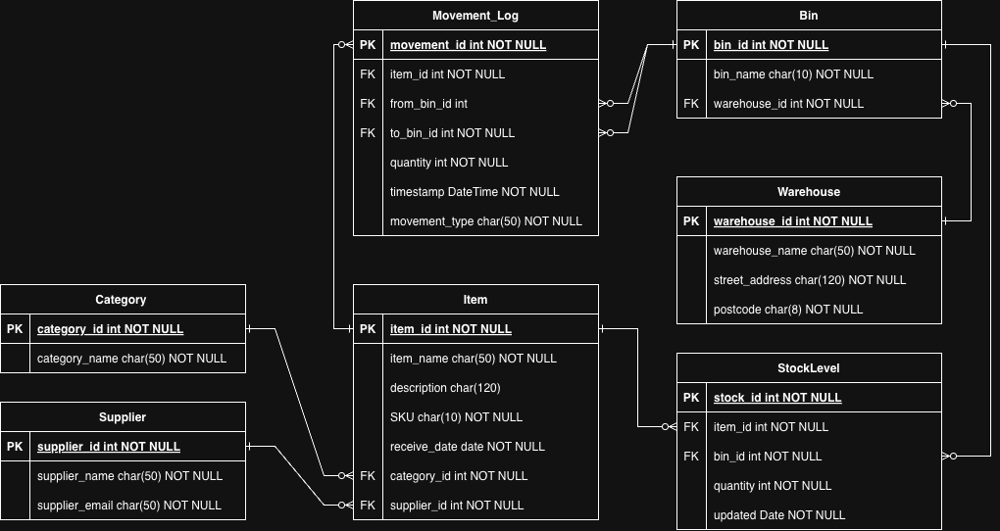

# Inventory Management System

## Overview
This is a comprehensive inventory management system built with Django. The system allows tracking of inventory across multiple warehouses, managing stock levels, and recording movement of items between locations.

## Features
- Multi-warehouse inventory management
- Categorization of items
- Supplier management
- Bin location tracking
- Stock level monitoring
- Movement logging with different movement types
- API's for external system integration

## Project Structure

### Apps
- **core**: Main application with all inventory models and business logic
- **analytics**: Data analysis and reporting functionality (WIP)
- **api**: RESTful API for integration with other systems

### Core Models

#### Category
Categorizes inventory items for better organization and reporting.

#### Supplier
Tracks vendors who provide inventory items with contact information.

#### Warehouse
Physical locations where inventory is stored, including address details.

#### Bin
Specific locations within warehouses where items are stored. Each bin has a unique name that starts with its warehouse name.

#### Item
Products or materials tracked in the inventory system, with unique SKUs, descriptions, and relationships to categories and suppliers.

#### StockLevel
Tracks the quantity of each item in specific bin locations with automatic timestamp updates.

#### MovementType
Defines different types of inventory movements (new stock, transfers, dispatches, returns, adjustments).

#### MovementLog
Records the movement of items between bin locations, including quantity, timestamp, and movement type.

## Entity Relationships
- Categories have many Items
- Suppliers have many Items
- Warehouses have many Bins
- Bins have many StockLevels
- Items have many StockLevels
- MovementLogs track item movements between Bins
- MovementTypes classify different kinds of movements



## Environment Variables

This project uses environment variables for configuration, especially for database credentials and sensitive settings. Before deployment, you should set up the following environment variables in a `.env` file or your deployment environment:

- DB_ENGINE=django.db.backends.postgresql (if using PostgreSQL)
- DB_NAME=your_db_name
- DB_USER=your_db_user
- DB_PASSWORD=your_password 
- DB_HOST=your.db.host.or.ip DB_PORT=5432

## Deployment Instructions

### Local Development
For local development ensure you have created a local database updated `.env` file with the necessary environment variables.

**Important**: Never commit `.env` files to version control. Add them to your `.gitignore`. Current database configured to use PostgreSQL.

### Production Deployment (TBD)
For production deployment on AWS:
- Use AWS RDS for the PostgreSQL database
- Configure environment variables in the AWS deployment settings
- Store sensitive credentials in AWS Secrets Manager or Parameter Store

## Setup Instructions

### Prerequisites
- Python 3.8+
- PostgreSQL 12+ (or your preferred database)
- Django 4.0+

### Installation
1. Clone the repository
2. Create a virtual environment:
   ```
   python -m venv env
   source env/bin/activate  # On Windows: env\Scripts\activate
   ```
3. Install dependencies:
   ```
   pip install -r requirements.txt
   ```
4. Create a `.env` file with your environment variables (see above)
5. Run migrations:
   ```
   python manage.py migrate
   ```
6. Seed the database with initial data:
   ```
   python manage.py seed_data
   ```
7. Create a superuser:
   ```
   python manage.py createsuperuser
   ```
8. Run the server:
   ```
   python manage.py runserver
   ```

## Usage

### Admin Interface
Access the admin interface at `/admin` to manage all inventory data.

### Bin Naming Convention
Bin names must follow the format: `{warehouse_name}-{location_code}`. This is enforced by model validation.

### Movement Tracking
All inventory movements are logged with:
- Source bin
- Destination bin
- Item moved
- Quantity
- Movement type
- Timestamp

### API
The RESTful API allows external systems to:
- Create a new item
- Inbound new stock to a warehouse 
- Move stock between bins

### Testing(TBD)
(Standard testing scripts to be added here)